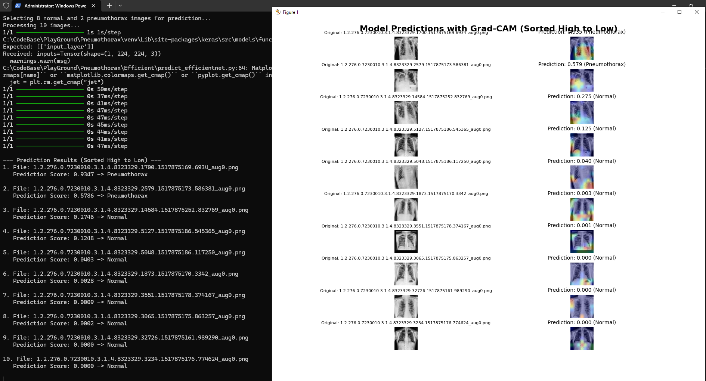

# High-Performance Pneumothorax Detection with Deep Learning

**Disclaimer:** This project is for educational purposes only and is not intended for clinical use. The model should not be used for self-diagnosis or as a substitute for professional medical advice.

This project focuses on developing a deep learning model to accurately detect pneumothorax (collapsed lung) from chest X-ray images. The goal is to build a high-performance model that can serve as a reliable tool for radiologists.

## Dataset

The model is trained and evaluated on the **SIIM-ACR Pneumothorax Segmentation dataset**. You can find more information about the dataset on Kaggle:
[https://www.kaggle.com/c/siim-acr-pneumothorax-segmentation](https://www.kaggle.com/c/siim-acr-pneumothorax-segmentation)

The dataset contains chest X-ray images in DICOM format, along with masks indicating the location of pneumothorax for positive cases.

## Models

We have experimented with two different convolutional neural network (CNN) architectures:

### 1. ResNet50 (Baseline)

An initial model was developed using the ResNet50 architecture. This model achieved a recall of 75% at a prediction threshold of 0.0227, serving as a strong baseline for future experiments.

### 2. EfficientNetB0 (Current Focus)

To improve upon the baseline, we are currently working with the EfficientNetB0 architecture, known for its state-of-the-art performance and computational efficiency. The model is fine-tuned on the pneumothorax dataset.

## Project Structure

The project is organized as follows:

- `preprocess.py`: Script to generate labels from RLE data and preprocess DICOM images.
- `Efficient/`: Contains all scripts and resources related to the EfficientNet model.
  - `train_efficientnet.py`: Script to train the EfficientNetB0 model.
  - `evaluate_efficientnet.py`: Script to evaluate the trained model and find the optimal prediction threshold.
  - `predict_efficientnet.py`: Script to run predictions on sample images and generate Grad-CAM visualizations.
- `models/`: Stores the trained model weights.
- `data/`: Contains the raw dataset and is the destination for preprocessed images.

## How to Run

### 1. Preprocess the Data
Before training, you must preprocess the raw DICOM images. This script generates a `labels.csv` file from the RLE data and saves processed, resized images to the `data/preprocessed` directory.

```bash
python preprocess.py
```

### 2. Train the Model
Once the data is preprocessed, start the training process for EfficientNet:

```bash
python Efficient/train_efficientnet.py
```

### 3. Evaluate the Model
To evaluate the model's performance on the test set:

```bash
python Efficient/evaluate_efficientnet.py
```

### 4. Make Predictions
To test the model on new images and see Grad-CAM visualizations:

```bash
python Efficient/predict_efficientnet.py
```

## Results

This section showcases the performance of the fine-tuned EfficientNetB0 model.

### Model Performance

The evaluation script (`evaluate_efficientnet.py`) produces a plot showing the trade-off between precision and recall at different prediction thresholds. The model achieves strong performance, significantly improving upon the ResNet50 baseline.



### Grad-CAM Visualizations

To understand the model's decision-making process, we use Grad-CAM to generate heatmaps that highlight the areas of the image the model focused on for its prediction. The `predict_efficientnet.py` script generates a sorted plot of images and their corresponding heatmaps.


## API Usage

The model can also be accessed via a REST API. The `app.py` script launches a Flask server with a `/Chest/predict` endpoint that accepts POST requests containing a chest X-ray image.

### How to Run the API

```bash
python app.py
```

### Example Response

The API will return a JSON object with the prediction details:

```json
{
    "confidence": 85.76,
    "prediction": "Pneumothorax",
    "priority": "High"
}
```

This project provides a complete, end-to-end pipeline for detecting pneumothorax in chest X-ray images using a fine-tuned `EfficientNetB0` model. The final model achieves significantly higher precision and accuracy compared to a ResNet50 baseline, making it a more reliable tool for medical imaging analysis.

The project includes:
- **Data Preprocessing**: Converts raw DICOM images and RLE masks into a labeled, augmented dataset.
- **Optimized Training**: A robust training script (`Efficient/train_efficientnet.py`) with class weighting to handle data imbalance.
- **In-depth Evaluation**: A script to find the optimal prediction threshold to maximize recall (`Efficient/evaluate_efficientnet.py`).
- **Explainable AI (XAI)**: Generates Grad-CAM heatmaps to visualize the model's decision-making process (`Efficient/predict_efficientnet.py`).
- **API Deployment**: A ready-to-use Flask API (`app.py`) to serve the model over a network.

---

## Project Structure
```
.
├── Efficient/                  # Contains the final, high-performance model scripts
│   ├── train_efficientnet.py
│   ├── evaluate_efficientnet.py
│   └── predict_efficientnet.py
├── data/                       # Holds the raw and preprocessed data
├── app.py                      # Flask API for model deployment
├── preprocess.py               # Initial data preprocessing script
├── requirements.txt            # Project dependencies
└── README.md                   # This file
```

---

## Quickstart: Setup and Training

### 1. Install Dependencies
Activate your virtual environment and install the required packages.
```bash
pip install -r requirements.txt
# Also install Flask for the API
pip install Flask
```

### 2. Prepare Data
This only needs to be done once. This script reads the raw data, generates labels from the RLE CSV, and saves preprocessed PNG images.
```bash
python preprocess.py
```

### 3. Train the EfficientNet Model
Navigate to the `Efficient` directory and run the training script. This will create the `pneumothorax_efficientnet_finetuned.h5` model file.
```bash
cd Efficient
python train_efficientnet.py
```

--- 


3.  **Evaluate Model**
    ```bash
    python evaluate.py
    ```

4.  **Visualize with Grad-CAM**
    ```bash
    python gradcam.py
    ```

---

For details on each step, see the respective script and code comments.
