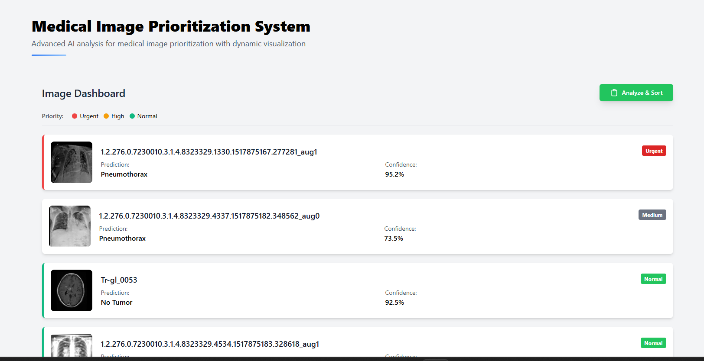
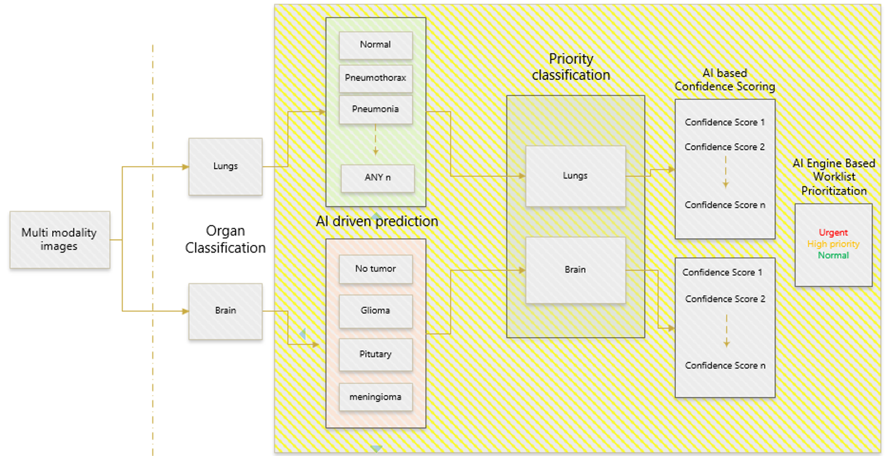
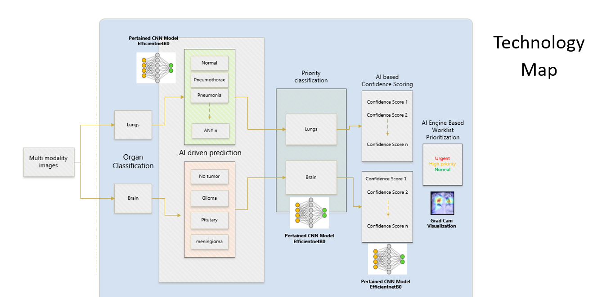
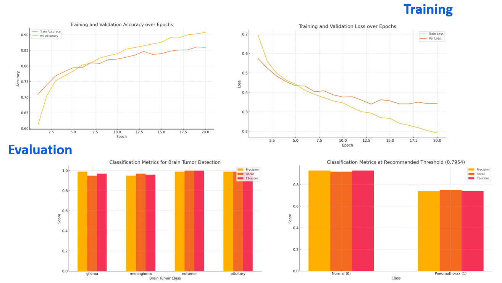
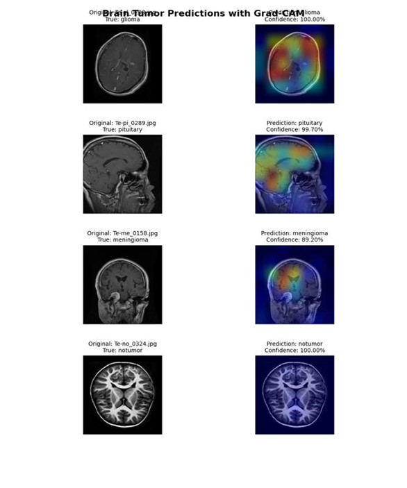
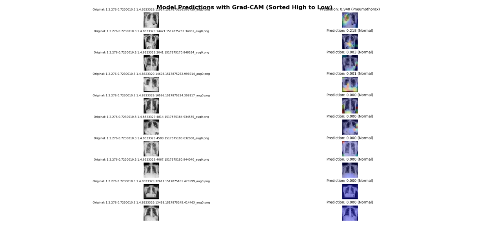

# Medical Image Prioritization System

Note: This frontend was just used for visualization purposes of the solution, this engine can be integrated with any client/server applications.
## Problem Overview
Radiologists often work through a large queue of imaging studies without initial indication of criticality. As a result:
- Life-threatening conditions may experience reporting delays.
- Emergency department throughput is affected.
- Radiologist workload is inefficiently balanced.

## Potential Impact on Users and Business
- Faster diagnosis of high-risk conditions.
- Radiologist efficiency improves & less time wasted scanning non-urgent studies.
- Emergency workflows are accelerated, improving patient outcomes.
- Legal/risk exposure is reduced for missed critical cases.

## How the AI Solution Works
AI analyzes radiology images in real-time, flags critical cases, and reprioritizes the worklist, enabling faster diagnosis, improved emergency response, reduced delays, and enhanced radiologist efficiency through intelligent triage and alerts.

## AI Technology Involved or developed
We developed a custom-trained CNN based on EfficientNet-B0, optimized for both brain and lung imaging analysis. The model was rigorously trained and evaluated on labeled datasets covering brain tumors (glioma, meningioma, pituitary) and lung conditions (normal and pneumothorax). A prioritization logic was implemented to flag and rank reports based on the severity of findings. Grad-CAM was used for visual interpretability, highlighting critical regions influencing AI predictions. This solution enables faster triage, accurate detection, and improved workflow efficiency for radiologists across neuro and chest imaging.

## Project Visuals

Here are some visuals from the project, including workflow diagrams and results:

### WorkFlow Design

### Technology Map

### Training & Validation results

Final Prediction & Heat Map using GradCam

### Brain Tumor

### Pneumothorax

## Collaborators
- Vinay Bhutange (https://github.com/VinayBhutange)
- Vishal Pandey (https://github.com/Victorpapa01)
